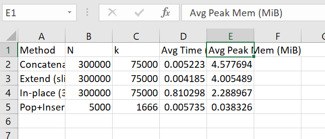

# rotate-list-elements-by-k-positions
Rotate a list items by k positions.

Common Slice Patterns::

| Slice        | Meaning                                       | Result                        |
| ------------ | --------------------------------------------- | ----------------------------- |
| `lst[a:b]`   | Elements from index `a` up to (not incl.) `b` | `[a, ..., b-1]`               |
| `lst[:b]`    | From start up to (not incl.) `b`              | `[0, 1, ..., b-1]`            |
| `lst[a:]`    | From `a` to end                               | `[a, ..., 9]`                 |
| `lst[:]`     | Copy of whole list                            | `[0,1,2,3,4,5,6,7,8,9]`       |
| `lst[-k:]`   | Last `k` elements                             | e.g. `lst[-3:] = [7,8,9]`     |
| `lst[:-k]`   | All but last `k` elements                     | e.g. `lst[:-3] = [0..6]`      |
| `lst[a:b:c]` | Step `c` between elements                     | e.g. `lst[::2] = [0,2,4,6,8]` |
| `lst[::-1]`  | Reverse list                                  | `[9,8,7,6,5,4,3,2,1,0]`       |
| `lst[-1]`    | Last element                                  | `9`                           |
| `lst[-2]`    | Second-to-last element                        | `8`                           |

Suppose:

lst = [0, 1, 2, 3, 4, 5, 6, 7, 8, 9]

Indices:

 0   1   2   3   4   5   6   7   8   9
 0   1   2   3   4   5   6   7   8   9
-10 -9  -8  -7  -6  -5  -4  -3  -2  -1

Quick recap you can keep in mind:

Slicing is [start:end) → start inclusive, end exclusive.

Negative indices count from the right.

Omitting end means "go until the end".

Note::

Python slicing rule

lst[start:end] means:

Start at index = start (inclusive)

Stop at index = end (exclusive)

If end is omitted → it goes all the way to the end of the list

| Method              | Time   | Space | Best for                              |
| ------------------- | ------ | ----- | ------------------------------------- |
| Concatenation (`+`) | O(n)   | O(n)  | Small–medium lists, readability       |
| `extend()`          | O(n)   | O(n)  | Same as above, slightly less overhead |
| Pop/insert loop     | O(n·k) | O(1)  | Only tiny lists, teaching purposes    |
| In-place reversal   | O(n)   | O(1)  | Large lists, memory-sensitive code    |

